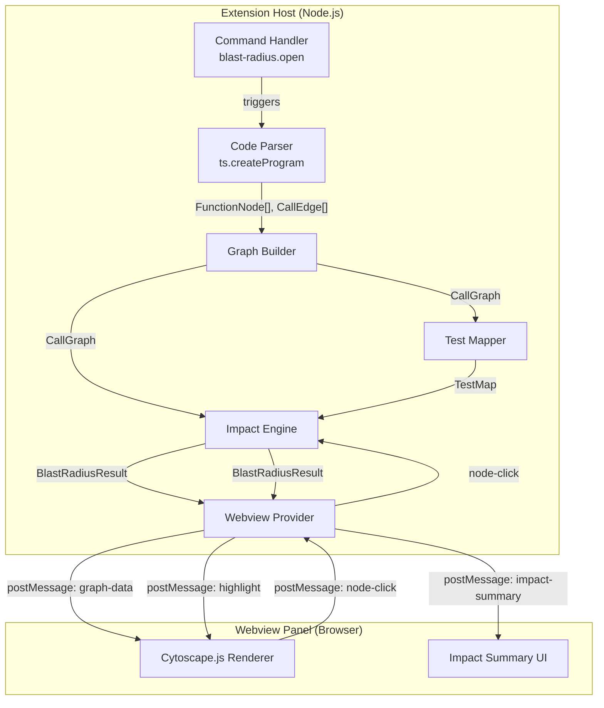

# Design Document

## Overview

Blast Radius is a VSCode extension that performs static analysis on TypeScript projects to build a call graph, maps Jest tests to source functions transitively, and renders the result as an interactive Cytoscape.js graph in a webview panel. When a developer clicks a function node, the extension computes and highlights the full upstream/downstream blast radius plus linked tests, and displays an impact summary.

The extension runs entirely locally — no source code or graph data leaves the machine. It targets TypeScript monorepos with Jest test suites and works unchanged in VSCode, Kiro, and Cursor.

### Key Design Decisions

1. **TypeScript Compiler API over Babel/tree-sitter**: The project already targets TypeScript and the TS Compiler API provides type-checked symbol resolution, which is critical for accurate call graph construction. Babel would require additional type resolution; tree-sitter provides syntax-only parsing without semantic information.

2. **Cytoscape.js over D3/vis.js**: Cytoscape.js is purpose-built for graph visualization with built-in layout algorithms (dagre, cose), pan/zoom, and node styling. D3 would require building graph primitives from scratch. vis.js is heavier and less actively maintained.

3. **Adjacency list graph representation**: Efficient for the traversal-heavy operations (BFS/DFS for upstream/downstream computation). Adjacency matrices would waste memory on sparse call graphs.

4. **postMessage bridge for host↔webview communication**: This is the standard VSCode webview communication pattern. The extension host owns the data; the webview owns the rendering. Messages are JSON-serializable, enabling clean separation.

5. **fast-check for property-based testing**: The leading PBT library for TypeScript/JavaScript, actively maintained, with strong arbitrary generators for structured data.

## Architecture



### Data Flow

1. User invokes `blast-radius.open` from the command palette.
2. **Code Parser** uses `ts.createProgram` to parse all `.ts` files under `src/`, walking the AST to extract function declarations and call sites.
3. **Graph Builder** deduplicates nodes by `(filePath, symbolName)` and constructs the `CallGraph` adjacency list.
4. **Test Mapper** parses `*.test.ts` / `*.spec.ts` files, resolves imports to graph nodes, then expands reachability transitively via the call graph.
5. **Webview Provider** creates the webview panel, serializes graph + test map to JSON, and sends it via `postMessage`.
6. **Cytoscape.js** renders the graph with styled nodes (source, test, module).
7. On node click, the webview posts the node ID back to the extension host.
8. **Impact Engine** computes upstream (reverse BFS), downstream (forward BFS), and linked tests, then sends highlight instructions + impact summary back to the webview.

## Components and Interfaces

### 1. Code Parser (`src/parser/codeParser.ts`)

Responsible for walking the TypeScript AST and extracting function definitions and call sites.

```typescript
interface FunctionNode {
  /** Unique identifier: relative file path + "#" + symbol name */
  id: string;
  /** File path relative to workspace root */
  filePath: string;
  /** Function/method name */
  symbolName: string;
  /** Start line number (1-based) */
  startLine: number;
  /** End line number (1-based) */
  endLine: number;
  /** Node kind: named function, arrow function, class method */
  kind: "function" | "arrow" | "method";
}

interface CallEdge {
  /** ID of the calling function node */
  callerId: string;
  /** ID of the called function node */
  calleeId: string;
}

interface ParseResult {
  nodes: FunctionNode[];
  edges: CallEdge[];
}

/**
 * Parse all .ts files under the given root directory.
 * Uses ts.createProgram with the workspace tsconfig.
 */
function parseProject(workspaceRoot: string): ParseResult;
```

**Implementation approach**: Create a `ts.Program` from the workspace `tsconfig.json`. For each source file, use `ts.forEachChild` to recursively walk the AST. Identify function declarations (`ts.SyntaxKind.FunctionDeclaration`), arrow functions assigned to variables (`VariableDeclaration` with `ArrowFunction` initializer), and class methods (`MethodDeclaration`). For call sites, match `CallExpression` nodes and resolve the called symbol using the TypeChecker's `getSymbolAtLocation` to map back to a declaration.

### 2. Graph Builder (`src/graph/graphBuilder.ts`)

Constructs the in-memory call graph from parse results.

```typescript
interface CallGraph {
  /** Map from node ID to FunctionNode */
  nodes: Map<string, FunctionNode>;
  /** Forward adjacency: caller ID → Set of callee IDs */
  forward: Map<string, Set<string>>;
  /** Reverse adjacency: callee ID → Set of caller IDs */
  reverse: Map<string, Set<string>>;
}

/**
 * Build a CallGraph from parsed nodes and edges.
 * Deduplicates nodes by ID (filePath#symbolName).
 */
function buildGraph(parseResult: ParseResult): CallGraph;
```

**Key invariant**: `nodes` contains exactly one entry per unique `(filePath, symbolName)` pair. Both `forward` and `reverse` maps reference only IDs present in `nodes`.

### 3. Test Mapper (`src/parser/testMapper.ts`)

Maps Jest test files to the source functions they exercise.

```typescript
interface TestMap {
  /** Map from test file path to set of FunctionNode IDs reachable transitively */
  mapping: Map<string, Set<string>>;
}

/**
 * Parse test files and build transitive test-to-source mapping.
 * 1. Find all *.test.ts and *.spec.ts files.
 * 2. Extract import statements, resolve to FunctionNode IDs.
 * 3. Expand each import set transitively via CallGraph forward edges.
 */
function buildTestMap(workspaceRoot: string, graph: CallGraph): TestMap;
```

**Transitive expansion**: For each directly imported function node, perform a BFS/DFS over `graph.forward` to collect all reachable callee nodes. The union of direct imports + transitive callees forms the test file's coverage set.

### 4. Impact Engine (`src/analysis/impactEngine.ts`)

Computes the blast radius for a selected node.

```typescript
interface BlastRadiusResult {
  /** The selected node ID */
  selectedNodeId: string;
  /** IDs of all downstream nodes (transitively called by selected) */
  downstream: Set<string>;
  /** IDs of all upstream nodes (transitively calling selected) */
  upstream: Set<string>;
  /** Test file paths that exercise the selected node */
  linkedTests: string[];
  /** Feature module names at risk */
  affectedModules: string[];
  /** Total count of affected function nodes */
  affectedCount: number;
}

/**
 * Compute blast radius for a given node.
 * - Downstream: BFS over graph.forward from selectedNodeId
 * - Upstream: BFS over graph.reverse from selectedNodeId
 * - Tests: filter TestMap for entries whose sets include selectedNodeId
 * - Modules: extract top-level src/ directories from affected node file paths
 */
function computeBlastRadius(
  nodeId: string,
  graph: CallGraph,
  testMap: TestMap,
): BlastRadiusResult;
```

**Feature module inference**: Extract the first path segment after `src/` from each affected node's `filePath`. Deduplicate to produce the list of at-risk modules.

### 5. Webview Provider (`src/webview/webviewProvider.ts`)

Manages the webview panel lifecycle and message passing.

```typescript
interface GraphDataMessage {
  type: "graph-data";
  nodes: SerializedFunctionNode[];
  edges: SerializedCallEdge[];
  testFiles: { path: string; linkedNodeIds: string[] }[];
  featureModules: string[];
}

interface HighlightMessage {
  type: "highlight";
  selectedNodeId: string;
  downstream: string[];
  upstream: string[];
  linkedTests: string[];
  affectedModules: string[];
  affectedCount: number;
}

interface NodeClickMessage {
  type: "node-click";
  nodeId: string;
}

/**
 * Create and manage the Blast Radius webview panel.
 */
class BlastRadiusPanel {
  constructor(extensionUri: vscode.Uri);
  show(graph: CallGraph, testMap: TestMap): void;
  handleNodeClick(nodeId: string, graph: CallGraph, testMap: TestMap): void;
  dispose(): void;
}
```

### 6. Webview Client (`media/graph.js`)

Runs inside the webview. Receives messages from the extension host, renders with Cytoscape.js, and posts click events back.

**Cytoscape.js configuration**:

- Layout: `dagre` (hierarchical, good for call graphs) with fallback to `cose` for dense graphs.
- Node styles: source functions (blue circles), test files (green diamonds), feature modules (orange rectangles).
- Highlight colors: downstream (red), upstream (purple), linked tests (green).
- Dimmed nodes: reduced opacity (0.15).

## Data Models

### Core Data Structures

```typescript
// Serialized forms for JSON transmission via postMessage

interface SerializedFunctionNode {
  id: string;
  filePath: string;
  symbolName: string;
  startLine: number;
  endLine: number;
  kind: "function" | "arrow" | "method";
}

interface SerializedCallEdge {
  callerId: string;
  calleeId: string;
}

interface SerializedCallGraph {
  nodes: SerializedFunctionNode[];
  edges: SerializedCallEdge[];
}

interface SerializedTestMap {
  entries: { testFile: string; functionNodeIds: string[] }[];
}
```

### Node ID Format

Node IDs follow the pattern `{relativePath}#{symbolName}`, e.g.:

- `src/cart/calculateTotal.ts#calculateTotal`
- `src/checkout/payment.ts#processPayment`
- `src/utils/math.ts#MathHelper.add` (for class methods: `ClassName.methodName`)

This format guarantees uniqueness within a workspace since no two functions can share the same file path and symbol name.

### Graph Invariants

1. **No duplicate nodes**: `nodes.size === new Set(nodes.keys()).size`
2. **Referential integrity**: Every ID in `forward` and `reverse` maps exists in `nodes`
3. **Symmetry**: If `forward.get(A).has(B)`, then `reverse.get(B).has(A)`
4. **No self-loops**: No node appears in its own forward or reverse adjacency set (a function calling itself is valid but tracked as a self-edge — this is an intentional design choice for recursive functions)

_Correction on invariant 4_: Self-loops ARE permitted for recursive functions. The invariant is: forward and reverse maps are consistent mirrors of each other, including self-edges.
