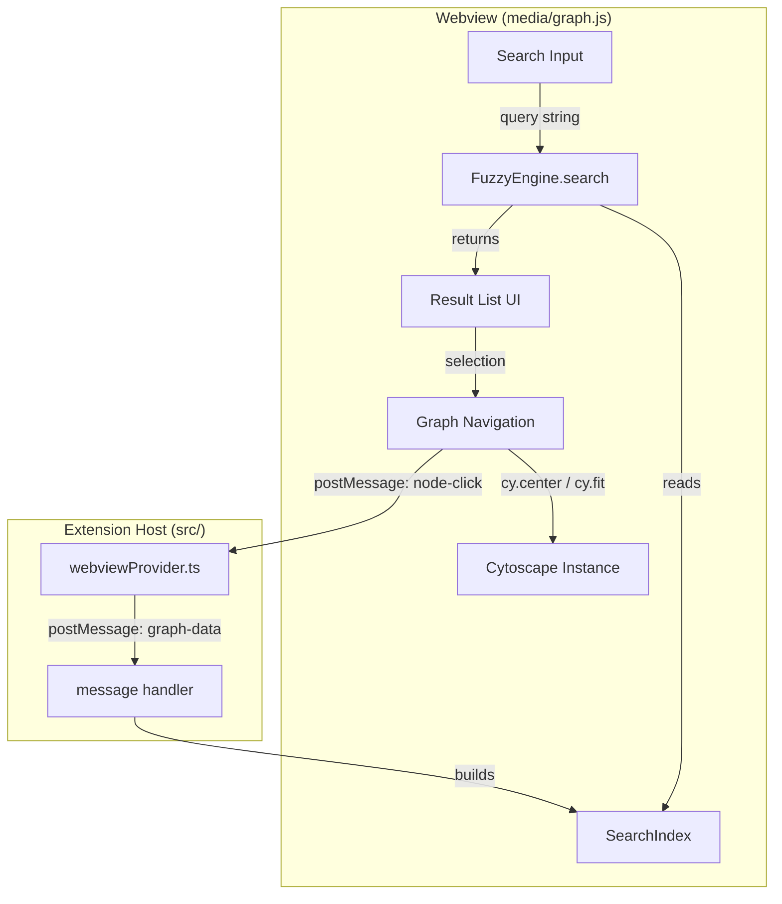
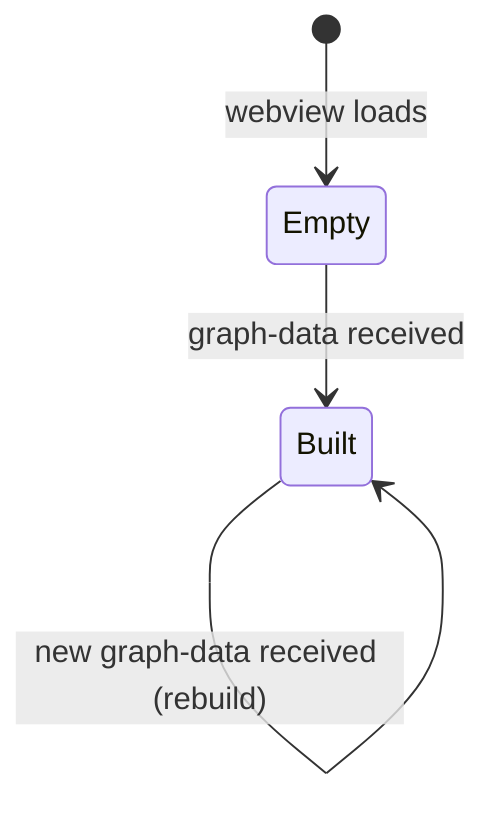

# Design Document: Fuzzy Search

## Overview

This design adds an in-webview fuzzy search system to the Blast Radius VS Code extension. The search lets users type approximate names to locate function nodes, test files, and modules within the Cytoscape.js graph visualization. All matching runs client-side in the webview using in-memory data — no external dependencies or network calls are introduced.

The system consists of three layers:

1. **Search Index** — built from graph data received via `postMessage`, organizing function nodes, test files, and module names into a flat searchable list.
2. **Fuzzy Matching Engine** — a scoring algorithm that supports exact prefix, substring, and non-contiguous character-sequence matching with case-insensitive comparison.
3. **Search UI** — an input field, dropdown result list, and keyboard navigation integrated into the existing webview HTML/JS.

### Key Design Decisions

- **No external library**: The fuzzy matcher is implemented as a self-contained function (~80 lines) inside `media/graph.js`. This avoids adding a dependency to the webview, keeps the CSP strict (`script-src 'nonce-...'`), and avoids bundle size concerns. The matching algorithm is simple enough that a custom implementation is more maintainable than wiring in a library.
- **Flat index, not a trie**: With a maximum of ~1000 items (Requirement 4.7), a linear scan with early termination is fast enough (<100ms). A trie or inverted index would add complexity without measurable benefit at this scale.
- **Scoring tiers**: The algorithm uses three match tiers (prefix > substring > subsequence) with tie-breaking by alphabetical order. This gives predictable, intuitive ranking without tuning weights.
- **Webview-only**: The search engine lives entirely in `media/graph.js`. The extension host (`src/`) is not involved in search — it only sends graph data as it does today.

## Architecture



**Data flow:**

1. Extension host sends `graph-data` message (existing flow, unchanged).
2. Webview `message` handler calls `buildSearchIndex()` to create the index from nodes, test files, and feature modules.
3. User types in the search input → `fuzzySearch(query, index)` returns scored, sorted results.
4. User selects a result → navigation handler centers/fits the graph and optionally triggers blast radius via `node-click`.

## Components and Interfaces

### 1. SearchIndex (data structure)

A flat array of `SearchItem` objects built when graph data arrives. Rebuilt on every `graph-data` message.

```typescript
/** Category of a searchable item */
type SearchCategory = "function" | "test" | "module";

/** A single searchable item in the index */
interface SearchItem {
  /** Unique identifier — node ID for functions, file path for tests, module name for modules */
  id: string;
  /** Primary display label (symbol name, file name, or module name) */
  label: string;
  /** Secondary display text (file path for functions/tests, empty for modules) */
  secondaryLabel: string;
  /** Item category for grouping and display */
  category: SearchCategory;
  /** Lowercase version of label, pre-computed for matching */
  labelLower: string;
  /** Lowercase version of secondaryLabel, pre-computed for matching */
  secondaryLower: string;
}
```

**Builder function:**

```javascript
function buildSearchIndex(graphData) → SearchItem[]
```

- Iterates `graphData.nodes` → creates items with `category: "function"`, `label: symbolName`, `secondaryLabel: filePath`, `id: node.id`
- Iterates `graphData.testFiles` → creates items with `category: "test"`, `label: fileName`, `secondaryLabel: path`, `id: path`
- Iterates `graphData.featureModules` → creates items with `category: "module"`, `label: moduleName`, `secondaryLabel: ""`, `id: moduleName`

### 2. FuzzyEngine (matching logic)

Pure functions with no side effects. The engine scores a query against a single item, then the search function scores all items and returns the top results.

```javascript
/**
 * Score a query against a single text string.
 * Returns { score: number, matches: number[] } or null if no match.
 *
 * Scoring tiers:
 *   - Exact prefix match:           score = 3.0 + (query.length / text.length)
 *   - Substring (contiguous) match: score = 2.0 + (query.length / text.length)
 *   - Subsequence match:            score = 1.0 + (matched / text.length)
 *
 * The fractional bonus rewards shorter targets (more specific matches).
 */
function fuzzyScore(query, text) → { score: number, matches: number[] } | null
```

```javascript
/**
 * Search the index for items matching the query.
 * Scores against both label and secondaryLabel, taking the better score.
 * Returns up to `limit` results sorted by score desc, then label asc.
 */
function fuzzySearch(query, index, limit = 20) → SearchResult[]
```

```typescript
/** A search result with score and match positions */
interface SearchResult {
  item: SearchItem;
  score: number;
  /** Character indices in the label that matched */
  labelMatches: number[];
  /** Character indices in the secondaryLabel that matched */
  secondaryMatches: number[];
}
```

**Matching algorithm detail:**

1. Lowercase both query and target text.
2. Check if target starts with query → prefix match (tier 3.0).
3. Check if target contains query as a contiguous substring → substring match (tier 2.0). Record the start index.
4. Otherwise, attempt subsequence matching: walk through target characters, greedily matching query characters in order. If all query characters are found → subsequence match (tier 1.0).
5. If none match → return `null`.
6. In all cases, record the indices of matched characters for highlight rendering.

### 3. Search UI Components

All UI is rendered as DOM elements inside the existing webview HTML. No framework — plain JS consistent with the existing `graph.js` style.

**Elements added to the webview HTML template (in `webviewProvider.ts`):**

```html
<!-- Search bar — positioned at top-center, above the graph -->
<div id="search-container">
  <input id="search-input" type="text"
         placeholder="Search functions, tests, modules…"
         autocomplete="off" spellcheck="false" />
  <ul id="search-results"></ul>
</div>
```

**Keyboard handling (in `graph.js`):**

| Key | Context | Action |
|-----|---------|--------|
| `/` | Input not focused | Focus search input |
| `Escape` | Input focused | Clear input, close results, return focus to graph |
| `ArrowDown` | Results visible | Move active highlight down |
| `ArrowUp` | Results visible | Move active highlight up |
| `Enter` | Results visible | Select the active (or first) result |

**Result rendering:**

- Results grouped by category in order: functions → tests → modules.
- Each result shows: category icon/badge, primary label with matched characters wrapped in `<mark>`, secondary label.
- Category icons: `ƒ` for functions, `⬡` for tests, `▣` for modules (rendered as styled `<span>` badges).
- Maximum 20 results displayed (Requirement 4.2).

**Graph navigation on selection:**

| Category | Action |
|----------|--------|
| Function | `cy.center(node)` + `cy.zoom(2)` + trigger `node-click` for blast radius |
| Test | `cy.center(node)` + `cy.zoom(2)` |
| Module | `cy.fit(moduleNodes, 60)` to fit all nodes in that module |

After selection: clear input, hide result list, return focus to graph.

### 4. Event Isolation

- The `#search-container` calls `event.stopPropagation()` on `click` and `mousedown` events to prevent them from reaching the Cytoscape canvas (Requirement 6.1).
- Clicking outside `#search-container` triggers a `focusout`/`click` handler that closes the result list (Requirement 6.2).

## Data Models

### SearchItem

| Field | Type | Description |
|-------|------|-------------|
| `id` | `string` | Unique identifier. For functions: `filePath#symbolName`. For tests: file path. For modules: module name. |
| `label` | `string` | Primary display text. |
| `secondaryLabel` | `string` | Secondary context text (file path or empty). |
| `category` | `"function" \| "test" \| "module"` | Item classification. |
| `labelLower` | `string` | Pre-lowercased label for matching. |
| `secondaryLower` | `string` | Pre-lowercased secondary label for matching. |

### SearchResult

| Field | Type | Description |
|-------|------|-------------|
| `item` | `SearchItem` | The matched index item. |
| `score` | `number` | Relevance score (higher = better match). |
| `labelMatches` | `number[]` | Indices of matched characters in `item.label`. |
| `secondaryMatches` | `number[]` | Indices of matched characters in `item.secondaryLabel`. |

### Index Lifecycle



The index is a module-level variable in `graph.js`. It is set to `null` on load and replaced entirely each time `graph-data` arrives. There is no incremental update — the full index is rebuilt, which is fast for ≤1000 items.

### Integration with Existing Types

The search system does not modify any existing TypeScript types in `src/types.ts`. It consumes the `GraphDataMessage` payload that the webview already receives. The `SearchItem` and `SearchResult` types exist only in the webview JavaScript (`media/graph.js`) as plain objects — no TypeScript interfaces are needed since the webview code is plain JS.


## Correctness Properties

*A property is a characteristic or behavior that should hold true across all valid executions of a system — essentially, a formal statement about what the system should do. Properties serve as the bridge between human-readable specifications and machine-verifiable correctness guarantees.*

### Property 1: Index completeness and correctness

*For any* valid graph data payload containing function nodes, test files, and feature modules, building the search index SHALL produce exactly one `SearchItem` per function node (with `label` equal to the symbol name, `secondaryLabel` equal to the file path, and `category` equal to `"function"`), one `SearchItem` per test file (with `label` equal to the file name, `secondaryLabel` equal to the full path, and `category` equal to `"test"`), and one `SearchItem` per module (with `label` equal to the module name and `category` equal to `"module"`). The total index length SHALL equal the sum of function nodes, test files, and modules.

**Validates: Requirements 2.1, 2.2, 2.3, 2.4, 8.1, 8.2, 8.3**

### Property 2: Index rebuild replaces old data

*For any* two distinct graph data payloads, building the index from the first payload and then rebuilding from the second payload SHALL produce an index that contains only items from the second payload. No items from the first payload SHALL remain unless they also appear in the second payload.

**Validates: Requirements 2.5**

### Property 3: Substring and subsequence matching coverage

*For any* non-empty target string and any non-empty string that is either a contiguous substring of the target or a subsequence (characters appearing in order) of the target, `fuzzyScore(query, target)` SHALL return a non-null result with a positive score.

**Validates: Requirements 3.1**

### Property 4: Score tier ordering

*For any* non-empty target string of length ≥ 3, given three queries derived from it — a prefix query (first N characters), a non-prefix substring query (a contiguous middle segment), and a subsequence-only query (non-contiguous characters) — the prefix query SHALL score strictly higher than the substring query, and the substring query SHALL score strictly higher than the subsequence query.

**Validates: Requirements 3.2**

### Property 5: Results sorted by score descending, ties by label ascending

*For any* search index and any query, the array returned by `fuzzySearch(query, index)` SHALL be ordered such that for every consecutive pair of results `(r[i], r[i+1])`, either `r[i].score > r[i+1].score`, or `r[i].score === r[i+1].score` and `r[i].item.label <= r[i+1].item.label` (lexicographic comparison).

**Validates: Requirements 3.3, 3.4**

### Property 6: Case-insensitive matching

*For any* query string and target string, `fuzzyScore(query, target)` SHALL return the same score and the same match/no-match outcome regardless of the casing of the query. That is, `fuzzyScore(query.toUpperCase(), target)` and `fuzzyScore(query.toLowerCase(), target)` SHALL produce equal scores (or both return null).

**Validates: Requirements 3.5**

### Property 7: Exact label round-trip

*For any* search index containing at least one item, searching with the exact `label` of any item in the index SHALL return that item as the first result (index 0) in the results array.

**Validates: Requirements 3.6**

### Property 8: Maximum result count

*For any* search index of any size and any non-empty query, `fuzzySearch(query, index)` SHALL return at most 20 results.

**Validates: Requirements 4.2**

### Property 9: Match indices validity

*For any* query and target string where `fuzzyScore(query, target)` returns a non-null result, every index in the `matches` array SHALL be a valid index within the target string (0 ≤ index < target.length), the indices SHALL be in strictly ascending order, and the characters at those indices in the target (lowercased) SHALL equal the corresponding characters of the query (lowercased).

**Validates: Requirements 4.5**

## Error Handling

### Empty or Whitespace Queries

- If the query is empty or contains only whitespace, `fuzzySearch` returns an empty array immediately. The UI hides the result list.

### Missing Graph Data

- If `buildSearchIndex` is called before any graph data has been received (or with `null`), it returns an empty array. Searches against an empty index return no results.

### Malformed Node IDs

- The index builder extracts `symbolName` from the node ID by splitting on `#`. If the `#` separator is missing, the entire ID is used as the label. This is defensive — it should not happen with well-formed data from the extension host.

### Cytoscape Node Not Found

- When navigating to a search result, if `cy.getElementById(id)` returns an empty collection (node was removed or ID mismatch), the navigation is a no-op. No error is thrown.

### Large Indexes

- For indexes exceeding the expected ~1000 items, the linear scan still completes but may exceed the 100ms target. No explicit error is raised — the UI remains responsive because the search runs synchronously on the main thread and the result list updates after the scan completes.

## Testing Strategy

### Property-Based Tests (fast-check)

The project already includes `fast-check` as a devDependency. Property-based tests will be written for the 9 correctness properties defined above. These tests exercise the pure functions (`buildSearchIndex`, `fuzzyScore`, `fuzzySearch`) extracted into a testable module.

**Test file**: `src/test/search/fuzzySearch.test.ts`

Since the fuzzy search logic lives in `media/graph.js` (plain JS for the webview), the pure functions (`fuzzyScore`, `fuzzySearch`, `buildSearchIndex`) will be extracted into a shared module `media/searchEngine.js` that can be imported by both `graph.js` and the test suite. The test file will import these functions directly.

**Configuration**:
- Minimum 100 iterations per property test (`numRuns: 100`)
- Each test tagged with: `Feature: fuzzy-search, Property {N}: {title}`

**Generators needed**:
- `graphDataArb`: Generates random `GraphDataMessage`-shaped objects with 1–50 function nodes, 0–10 test files, and 0–5 modules. Node IDs follow the `path#symbol` format.
- `searchableStringArb`: Generates non-empty alphanumeric strings of length 1–30 for use as labels and queries.
- `prefixQueryArb(target)`: Extracts a random prefix from a target string.
- `substringQueryArb(target)`: Extracts a random contiguous substring from a target string.
- `subsequenceQueryArb(target)`: Extracts a random subsequence (non-contiguous characters in order) from a target string.

### Unit Tests (Mocha)

Example-based unit tests cover UI interactions, keyboard handling, and specific edge cases:

- **Search input**: Placeholder text, `/` key focus, `Escape` key clear
- **Keyboard navigation**: ArrowUp/ArrowDown index tracking, Enter selection, wrap-around behavior
- **Result rendering**: Category badges, match highlighting markup, "No results found" text
- **Graph navigation**: Function selection triggers `node-click`, test selection centers viewport, module selection fits viewport
- **Event isolation**: Click on result list does not propagate to Cytoscape canvas
- **Edge cases**: Empty query returns no results, single-character queries, queries longer than any label

### Test Organization

```
src/test/search/
  fuzzySearch.test.ts      # Property-based tests for search engine logic
  searchUI.test.ts         # Unit tests for UI interactions and rendering
```

### What Is NOT Tested

- Visual appearance (CSS styling, theme variable usage) — verified by manual inspection
- Performance under 100ms — verified by manual benchmarking, not automated in CI
- Data privacy (no network requests) — enforced by CSP and verified by existing `webviewProvider` tests
